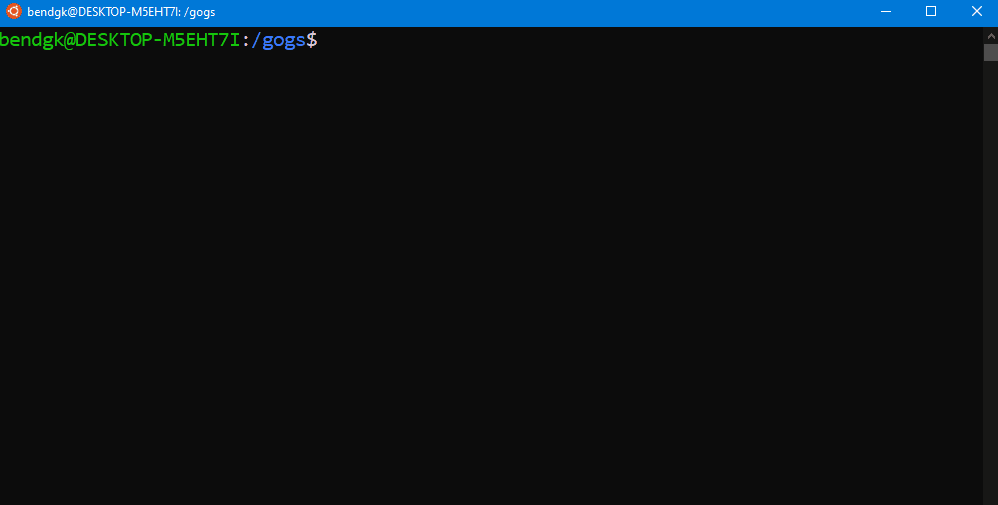

<!-- PROJECT LOGO -->
<br />
<p align="center">
  <a href="https://github.com/GambitLLC/gogs">
    
  </a>

  <h3 align="center">gogs</h3>

  <p align="center">
    a blazingly fast minecraft server
    <br />
    <!--<a href="https://github.com/GambitLLC/gogs"><strong>Explore the docs »</strong></a>-->
    <br />
  </p>
</p>


<!-- TABLE OF CONTENTS -->
<details open="open">
  <summary><h2 style="display: inline-block">Table of Contents</h2></summary>
  <ol>
    <li>
      <a href="#about-the-project">About The Project</a>
      <ul>
        <li><a href="#built-with">Built With</a></li>
      </ul>
    </li>
    <li>
      <a href="#getting-started">Getting Started</a>
      <ul>
        <li><a href="#prerequisites">Prerequisites</a></li>
        <li><a href="#installation">Installation</a></li>
      </ul>
    </li>
    <li><a href="#usage">Usage</a></li>
    <li><a href="#roadmap">Roadmap</a></li>
  </ol>
</details>


<!-- ABOUT THE PROJECT -->

## About The Project



Here's a blank template to get started:
**To avoid retyping too much info. Do a search and replace with your text editor for the following:**
`github_username`, `repo_name`, `twitter_handle`, `email`, `project_title`, `project_description`


### Built With

* [gnet](https://github.com/panjf2000/gnet)
* [golangmc](https://github.com/GoLangMc)
* [go-mc](https://github.com/Tnze/go-mc)


<!-- GETTING STARTED -->

## Getting Started

To get a local copy up and running follow these simple steps.

### Installation

1. Clone the repo
   ```
   git clone https://github.com/GambitLLC/gogs
   ```
2. Install Go modules
   ```sh
   go get
   ```
3. Build the project
   ```sh
   go build
   ```


<!-- USAGE EXAMPLES -->

## Usage

To start a gogs server instance
```sh
./gogs
```

_For more examples, please refer to the [Documentation](https://example.com)_


<!-- ROADMAP -->

## Roadmap TBD

See the [open issues](https://github.com/GambitLLC/gogs/issues) for a list of proposed features (and known issues).
